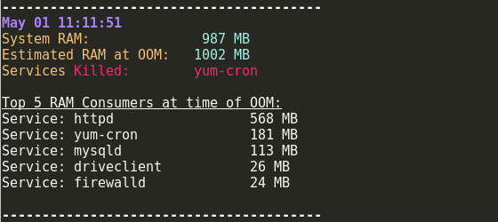
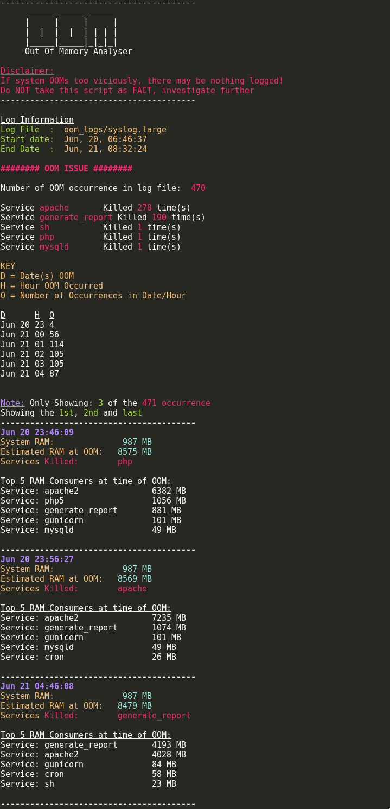

# Out-Of-Memory Investigation .py


The following python script can be used to calculate the estimated RSS (RAM) value of each service at the time a kernel invoked OOM killer.

At the time of an OOM incident, the system logs the estimated RSS value of each service in its system log. Based off of this information the script will calculate how much RAM the services were "theoretically" trying to use, the total RAM value of all services and how much RAM your system actually has to offer these services. Allowing for further investigation into the memory usage of the top "offending" service(s).


The script looks in `/var/log/messages` or `/var/log/syslog` and takes the values recorded by the system just before the incident occurs. 


<br />

##  Running

Usage:


There are currently 3 methods for running.

If no argument is parsed, it will default to using the current ACTIVE system log:

```
python oom-investigate.py
```
You can also specify an old/rotated/compresses log:
```
python oom-investigate.py -f <old_rotated_file>
```
Or you can summarise the log files quickly with:
```
python oom-investigate.py -q
```
<br />

<br/>

### Method(s)

<br />

```
wget https://raw.githubusercontent.com/LukeShirnia/out-of-memory/master/oom-investigate.py
```

or

```
git clone https://github.com/LukeShirnia/out-of-memory.git
```

or 

```
curl -s https://raw.githubusercontent.com/LukeShirnia/out-of-memory/master/oom-investigate.py | python
```

<br />

## NOTE:

The script currently works on the following OS:

*  RHEL/CentOS 6,7

*  Ubuntu 14.04LTS/16.04LTS

*  Redhat/CentOS 5 - Only works on some devices,AND you may need to specify python2.6 or 2.6 

<br />

<br />

## Script Breakdown:

The output from this script can be broken down into 4 main sections:

<br />

### Section 1 - Log File Information
This section is a quick overview of the log file used for reference. 
<br />
Example:


<br />

### Section 2 - Total Services Killed 
During out-of-memory investigations its not always obvious what service(s) have been killed, especially when most of the entries in the system log shows httpd/apache. This output allows you to quickly discover if a backup agent or mysql was killed at some point in the start/end date of the log file.
<br />
Example:


<br />

### Section 3 - Date of OOM Issues
This helps narrow down problematic times such as; peak traffic times, backup times etc
<br />
Example:


<br />

### Section 4 - Top 5 OOM Consumers
This section allows you to narrow down the cause of heaviest memory consumer. This gives you a good starting point to prevent the issue occuring again. 
<br />
Example:



<br />

<br />

<br />


### Full Example Output
The following example shows the output of the script when run against a compressed log file in a "non standard" directory:



<br />

<br />

### Example - No OOM in log file
This example shows the output when NO oom has occurred in the log file. NO options were passed with the running of this script (Method 1 was used).

The script will now prompt you to enter an option if the main file doesn't contain any oom incidents but another file does:


